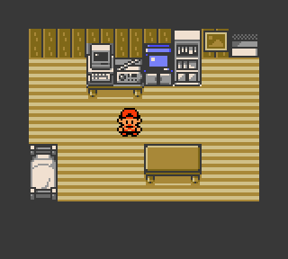
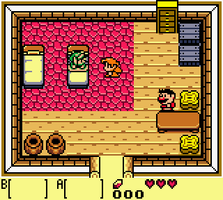

<h1 align="center">
   &nbsp;&nbsp;×&nbsp;&nbsp;  &nbsp;&nbsp;|&nbsp;&nbsp; VideoGameBench RL Environment Template
</h1>

**A [HUD](https://hud.ai) environment for evaluating AI agents on classic Game Boy games.**

An external agent (any vision-capable LLM) is dropped into a running game, sees the
screen as an image each turn, presses buttons with a tool, and is scored on how far
it gets. The environment exposes the game over [MCP](https://modelcontextprotocol.io)
so HUD's agents (Claude, GPT, Gemini, …) can play and be benchmarked.

The game runs **turn-based**: it only advances during a tool call, so it never moves
on while the model is thinking. That makes runs deterministic and a clean fit for
request/response agents. Powered by the [PyBoy](https://github.com/Baekalfen/PyBoy)
emulator.

It ships with a free, bundled homebrew game, so you can deploy and run evals **out of
the box**.

> Game prompts, checkpoint images, and the game list come from
> **[VideoGameBench](https://github.com/alexzhang13/videogamebench)** (Zhang et al.,
> arXiv:2505.18134) — a benchmark for VLMs playing real games. See it for more games
> and background.

---

## Models playing

| Claude Opus — Pokémon Crystal | Claude Sonnet — Zelda: Link's Awakening |
|---|---|
|  |  |

*(Recorded locally via `VGBENCH_RECORD=1` + `make_video.py` — see "Recording videos".)*

---

## Quickstart

```bash
uv sync                              # install deps into a venv
hud set HUD_API_KEY=your-key-here    # get one at hud.ai/project/api-keys
```

Run a **real eval** locally — the game runs on your machine, the model is called
through HUD's gateway (no separate model key needed):

```bash
# the bundled homebrew test game (no ROM needed)
hud eval tasks.py claude --model claude-sonnet-4-6 \
    --task-ids play-libbet-test --max-steps 40 --auto-respond -y
```

Pick any vision model from `hud models list`, and any task slug from `tasks.py`
(`play-libbet-test`, `play-pokemon-crystal`, `play-zelda`). Use the `openai` agent
for GPT models, `claude` for Claude, `gemini` for Gemini. `--auto-respond` keeps the
agent going if it replies without a tool call.

Local development:

```bash
hud serve env:env                    # serve the environment locally
uv run pytest tests/                 # run the test suite
uv run local_run.py --game test --steps 60 --out logs/test   # scripted smoke run (no model)
```

Deploy to HUD's cloud and run there:

```bash
hud deploy .                         # build + deploy (slow; run once)
hud sync tasks vgbench               # push tasks (fast; re-run on task changes)
hud eval vgbench --remote --full     # run on the platform
```

**Iteration loop:** `hud deploy` is the slow step. After it, editing `tasks.py` only
needs `hud sync tasks`. Redeploy only when code, game configs, ROMs, or the Dockerfile change.

---

## Games

| `--game` | ROM (`roms/`) | Scoring | Status |
|----------|---------------|---------|--------|
| `test` | `libbet.gb` ✅ bundled | exploration | runs out of the box |
| `pokemon_crystal` | `pokemon_crystal.gbc` | RAM (dense) + checkpoint + exploration | provide your ROM |
| `zelda` | `zelda_links_awakening.gbc` | checkpoint + exploration | provide your ROM |

`test` works with no setup. The others need you to supply the ROM (see
[Providing ROMs](#providing-roms)). **Adding your own game is easy — see
[`docs/ADDING_GAMES.md`](docs/ADDING_GAMES.md).**

---

## How it works

The environment is an **MCP server** (`env.py`). It exposes:

- **Tools** the agent calls to act.
- A **template** (`play-game`) that boots the game, hands the agent a prompt, lets it
  play, and computes a final score.

The template is an async generator that yields twice: first the **setup prompt**, then
the **final reward** (a HUD `EvaluationResult`). Scoring runs *inside each tool call*
(the game advances, the new frame is scored), and the final yield reports the total
reward plus a per-scorer breakdown.

### Agent tools

| Tool | Description |
|------|-------------|
| `press_buttons(buttons, frames=15)` | Press one or more of `A B START SELECT UP DOWN LEFT RIGHT`, then return the new screen. |
| `wait(frames=30)` | Advance the game without input (let animations/dialogue play). |
| `screenshot()` | Return the current screen without advancing. |

Every action returns text + the current screen as an MCP image block — the native
160×144 frame upscaled 3× (nearest-neighbor) to 480×432 for legibility; scoring uses
the raw 160×144 frame. Each prompt is assembled from a shared **controls** block (the
tools + button semantics) plus the game's own `prompt.txt` (lore/strategy).

### Files

| File | Role |
|------|------|
| `env.py` | The MCP server: tools + the `play-game` template. **Entry point** (`hud serve env:env`). |
| `emulator.py` | `GameBoyEmulator` — headless PyBoy wrapper. |
| `scoring.py` | Scorers (checkpoint / RAM / exploration) → a HUD `EvaluationResult`. |
| `games_loader.py` | Loads `games/<game>/` into a `GameSpec`. |
| `tasks.py` | Task instances for `hud eval` / `hud sync tasks`. |
| `games/<game>/` | Per-game config, prompt, and assets. |
| `roms/` | ROMs (only the bundled test ROM is committed). |
| `make_video.py`, `local_run.py` | Dev tools (record videos, scripted smoke runs). |

---

## Scoring

A game combines one or more scorers (configured in `games/<game>/config.yaml`); each
contributes a weighted sub-score, and the final reward is their weighted sum
(0.0–1.0).

- **`exploration`** — distinct screens reached / a target. Generic; works for any
  game with no extra setup.
- **`checkpoint`** — progress through an ordered set of checkpoint screenshots
  (`checkpoints/*.png`), matched by perceptual hash. Sparse, milestone-based.
- **`ram`** — *dense* reward read directly from Game Boy memory (e.g. Pokémon badges,
  party levels, money). Richer than screenshot-only scoring.

```yaml
# games/<game>/config.yaml
scoring:
  - type: ram
    weight: 0.5
  - type: checkpoint
    threshold: 8
    weight: 0.5
```

See [`docs/ADDING_GAMES.md`](docs/ADDING_GAMES.md) for writing RAM maps and finding
addresses.

---

## Providing ROMs

Only the bundled `libbet.gb` is included — it's "Libbet and the Magic Floor",
zlib-licensed homebrew, so the `test` game runs with no setup. Other ROMs are
copyrighted and **not** shipped: drop your legally-owned `.gb` / `.gbc` files into
`roms/` using the filename in the Games table. `roms/` is git-ignored (except the
test ROM), so you never commit copyrighted data, and they're kept out of the built
image. For remote (`--remote`) runs, inject ROMs at deploy time rather than baking
them into a public image. See [`roms/README.md`](roms/README.md).

---

## Recording videos

Set `VGBENCH_RECORD=1` (or `VGBENCH_RECORD_DIR=<dir>` to choose where) when running an
eval, then assemble the frames:

```bash
VGBENCH_RECORD_DIR=logs/rec/myrun hud eval tasks.py claude \
    --model claude-sonnet-4-6 --task-ids play-libbet-test --max-steps 60 --auto-respond -y
uv run make_video.py --dir logs/rec/myrun --out out.mp4          # or out.gif
```

---

## Notes & limits

- **Turn-based only.** The emulator ticks only inside tool calls, so the game is
  paused while the model thinks. Real-time play isn't modeled — it doesn't fit a
  request/response agent.
- One game instance per container (HUD runs one container per evaluation).
- Template code is yours to adapt; **the games are not** — supply them legally.

---

## Acknowledgments

Built on **[VideoGameBench](https://github.com/alexzhang13/videogamebench)** (Zhang et al., arXiv:2505.18134) — the games, prompts, and checkpoint images come from there — and powered by the **[PyBoy](https://github.com/Baekalfen/PyBoy)** Game Boy emulator.